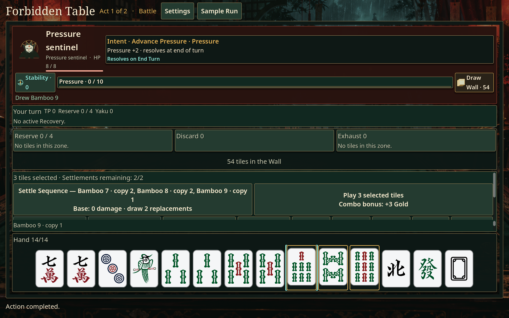
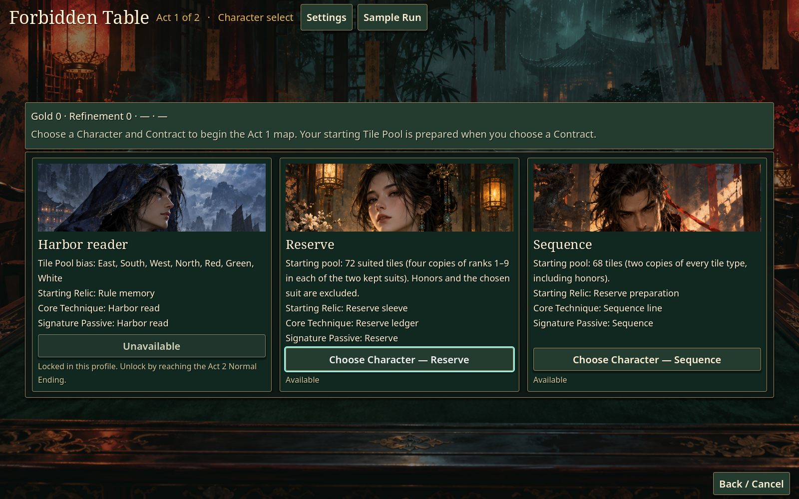
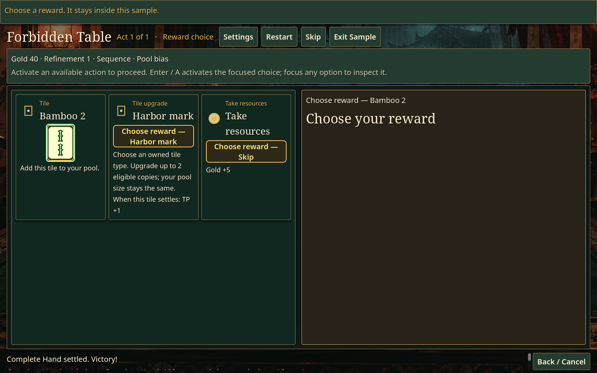
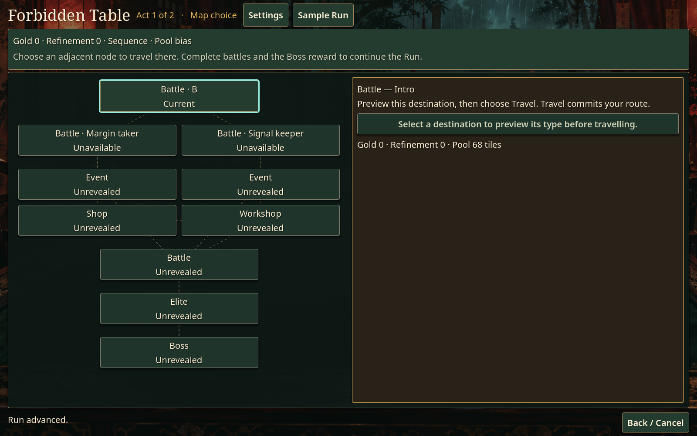

# Forbidden Table

**Turn a mahjong hand into a roguelite build.** Forbidden Table is a single-player, turn-based game where you draw and arrange tiles, settle patterns, and adapt your build as you travel through two Acts. Each turn asks you to balance a stronger hand against the enemy's next move—and decide which tiles you can afford to let go.

**[Download the Windows MVP](https://github.com/sunnyday9/Forbidden-Table/releases/tag/v1.0.0-mvp.1)** · [Report a problem or suggest an improvement](https://github.com/sunnyday9/Forbidden-Table/issues)

The current version is **1.0.0-mvp.1**, an experimental Windows x64 prerelease.



*Actual MVP gameplay: inspect the enemy's Intent and choose what to do with the tiles in your Hand.*

## What makes the game stand out?

- **Mahjong as tactical combat.** Pairs, sequences, and triplets help you cycle your hand; a Complete Hand converts your score into damage. Action previews show the base outcome before you commit.
- **A build that changes throughout the Run.** Choose a Character and a Contract, then collect tiles, tile upgrades, Relics, Techniques, and rule breakers. Rewards can strengthen your plan or offer a reason to change direction.
- **A route through two Acts.** Battles, Events, Shops, Workshops, Elites, and Bosses give you different opportunities to spend resources and improve your Tile Pool.
- **A decision before every End Turn.** Play 1–3 tiles from your Hand. If all three tiles played that turn form a sequence or triplet, earn **+3 Gold**. Keep your best hand intact, or cash in a group for resources.
- **A hand you can arrange yourself.** Sort by suit and rank, drag tiles into your preferred order, or use Move left / Move right. Discard stays compact and shows a tile count.
- **Help while you learn.** The built-in Sample Run introduces the game in a separate practice session. Settings include English / 简体中文, UI scale, animation speed, and reduced motion.

## Download and start playing

1. Open [the MVP release](https://github.com/sunnyday9/Forbidden-Table/releases/tag/v1.0.0-mvp.1) and download `forbidden-table-1.0.0-mvp.1-windows-x64.zip` from **Assets**.
2. Extract the **entire ZIP** into a folder. Keep `ForbiddenTable.exe` and `ForbiddenTable.pck` together, along with the included documentation and licenses.
3. Run `ForbiddenTable.exe`. No Godot installation is needed to play the exported game. Windows 10/11 x64 is the intended target.
4. Open **Settings** to choose your language and display preferences. For your first session, choose **Sample Run** and follow its prompts; choose **Exit Sample** when you want to return to your campaign.

## How to play

### 1. Choose your starting build

Your **Character** supplies a starting Tile Pool, Relic, Core Technique, and passive. Your **Contract** adds benefits with a tradeoff, so read both sides before choosing. Sequence and Reserve are available in a fresh profile; some other choices require an unlock.



*Character cards explain your starting tools and show which choices are available in your profile.*

### 2. Read the table and build your hand

The goal of a battle is to defeat the enemy before **Pressure reaches its limit**. Inspect **Intent** to see what will happen when you end the turn. Draw from the Wall while you have draw actions available; a battle starts with **11 Hand tiles**, and the Hand holds at most **14**.

You do not need to know every mahjong scoring rule to begin:

| Shape | Example | How it helps |
| --- | --- | --- |
| Pair | Two identical tiles | A small pattern to settle, or the pair in a standard Complete Hand |
| Sequence | 2–3–4 of the same numbered suit | A three-tile pattern; ranks do not wrap from 9 to 1 |
| Triplet | Three identical tiles | Another three-tile pattern |
| Complete Hand | Four sequences/triplets plus a pair, or seven pairs | A valid 14-tile hand for a larger settlement |

Click tiles to select them, then inspect the actions offered for that selection. **Settle Pattern** consumes the selected pattern and draws replacements according to the preview. Small patterns mainly help exchange tiles; their damage depends on your build. **Complete Hand** settles a valid full hand for damage and enters Recovery. Use **Select hand** to select the whole Hand when checking a complete arrangement.

Your **Core Technique** provides another tool during battle. Check its effect, TP cost, and availability. **Reserve** lets you store a tile and swap it back later, but stored tiles lose Integrity as turns end and expire at 0. Stability effects can help lower Pressure; follow the action previews and enemy Intent when deciding what to use.

### 3. Play tiles, then end your turn

Before **End Turn**, you must **Play at least 1 and at most 3 Hand tiles in total that turn**. You can play them together or across several actions; the allowance is shared.

- Select the tiles you want to let go, then choose **Play**.
- If the three tiles played during that turn form a sequence or triplet, you receive **+3 Gold once that turn**.
- Playing moves tiles to **Discard**, costs no TP, and draws **no replacements**. Settling a pattern is a separate action and does not satisfy the Play requirement.
- After at least one tile has been played, **End Turn** becomes available. Ending the turn resolves enemy Intent and starts your next turn with a new Play allowance.

**First-run tip:** sort your Hand, look for a Complete Hand, and check Intent before spending tiles. A small settlement can improve your draws; playing a useful group for Gold can also make your next hand harder to finish.

### 4. Choose rewards and your next destination

After a victory, inspect your rewards: add a tile, improve an owned tile type, or take resources when those options are offered. As the Run continues, Relics and Techniques add effects, and special rewards can change the rules of your build. Gold pays for Shop offers and Workshop services; Refinement Tokens support certain improvements.



*Actual Sample Run gameplay: compare adding Bamboo 2, upgrading owned tiles with Harbor mark, or taking Gold. Practice rewards stay inside the sample.*

On the map, select an available destination to preview it, then choose **Travel** to commit. Adapt your route to your resources: fight for rewards, explore Events, buy tools in Shops, or refine your Tile Pool in Workshops. Complete each Act's Boss encounter and reward to progress through the two-Act Run.



*An Act 1 map from a new campaign. Later destinations are revealed as you progress.*

**Discard and permanent removal are different.** A tile played into Discard still belongs to your Run's Tile Pool and can appear in later battles. A Workshop removal permanently changes that pool.

## Controls and comfort

Use the mouse to choose actions and select tiles. Drag a Hand tile to reorder it, or select/focus it and use **Move left / Move right**. **Sort hand** groups suits and ranks; **Clear selection** resets your selection. Keyboard navigation supports **Tab / Shift+Tab**, **Enter** to activate a focused control, and **Esc** to go back or cancel a selection.

Settings let you switch between **English and 简体中文**, enlarge the UI, change presentation speed, and enable reduced motion. Tutorial hints can be toggled or reset. The screenshots above were captured from the released MVP; [capture details](docs/media/screenshots/README.md) identify the campaign and practice views.

## Saves, release status, and feedback

Saves and settings are in `%APPDATA%\Godot\app_userdata\Forbidden Table`. Back up that folder before trying a prerelease. Older saved battles retain their current rules; newly started battles use the Hand-play rule described above. Hand display order resets on restart. Some older replays are unavailable after rule changes. Pre-1.0 compatibility is not a general promise.

This MVP is available for feedback. The maintainer reports completing human two-Act validation, while fixed-seed progression failures and platform/device-specific coverage remain open. It is not the stable 1.0 release described by issues [#105](https://github.com/sunnyday9/Forbidden-Table/issues/105), [#106](https://github.com/sunnyday9/Forbidden-Table/issues/106), and [#107](https://github.com/sunnyday9/Forbidden-Table/issues/107).

Found a confusing action, a bug, or a balance issue? Please [open a GitHub Issue](https://github.com/sunnyday9/Forbidden-Table/issues) with the **version, language, Run seed, steps, and expected result**. Screenshots are helpful for UI problems.

## Development

<details>
<summary>Run from source, validate, and package</summary>

Use the pinned Godot version in `scripts/GODOT_VERSION` (currently **4.7.2**) and Python **3.12**. Open `project.godot` in Godot to run from source. Install matching Windows x64 export templates for packaging. Shell tools require Bash and GNU timeout.

```bash
python3 scripts/validate_localization.py
python3 -m unittest discover -s tests -p 'test_*.py'
bash scripts/test_mvp.sh
bash scripts/test.sh
bash scripts/package_windows_release.sh --output-dir dist
```

Set `GODOT_BIN` to an installed executable. The test wrapper can download the pinned Linux editor. Release packages require a clean Git checkout and include a checksum and source/build manifest. See [the release workflow](docs/release/MVP_RELEASE_WORKFLOW.md) for checks and evidence boundaries.

The MVP functional profile excludes the four simulation/benchmark/corpus suites, which remain in the full validation lane. Domain terms live in [CONTEXT.md](CONTEXT.md). Local builds, caches, and evidence are ignored by Git.

</details>

## Licensing

Original game source is licensed under [MIT](LICENSE). Third-party dependencies and assets retain their own licenses. Dependency and asset notices are in [THIRD_PARTY_NOTICES.md](docs/release/THIRD_PARTY_NOTICES.md) and travel with the Windows package.
