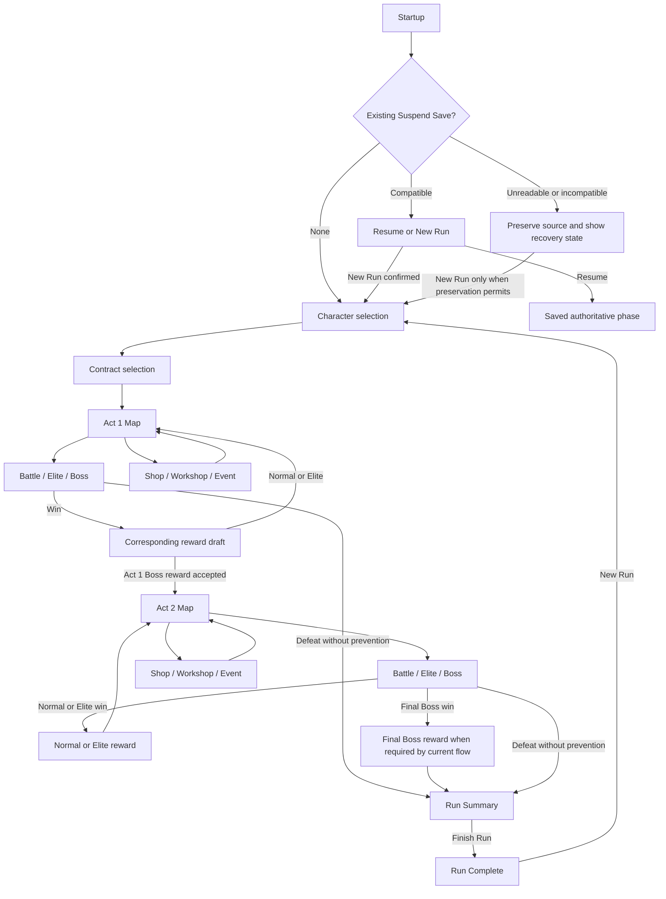
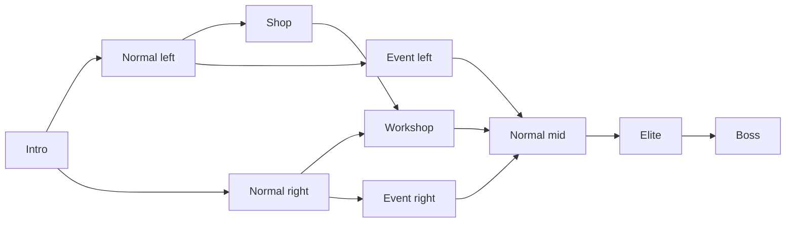

# Screen audit and Run flow

## Evidence and method

Read root `AGENTS.md`, `docs/agents/issue-tracker.md`, `docs/agents/domain.md`, root `CONTEXT.md`, ADR-0001, issue #98 and its live dependency summary, the Stage 4.5 spec, Project Spec §§3, 18–21 and 24, the Stage 4 accessibility, localization, presentation and Beta evidence reports. Live #72/#92/#96 are CLOSED with 2026-09-30 PASS comments; #98 is OPEN with `blocked_by=0`.

Audit source is `0f565b9` plus the spec-only cherry-pick. `RunScene` is the production entry point; its UI is built programmatically. The standalone `BattleScene` is also a presentation/test seam, not a second player journey. Read the Run presentation controller, state, summary presenter, map catalog, content labels and relevant definitions. Inspected all 18 Stage 4 accessibility captures as a contact sheet, then Contract, Battle, Shop, Workshop value choice and Summary at native 960×540. This is a design audit of existing evidence, not a fresh playthrough, physical-controller test, or regression gate rerun.

A read-only graphify traversal using graph vocabulary `run`, `battle`, `presentation`, `map` found Run/Act and authoritative Domain concepts but no useful current UI inventory. Source and captures supply the screen facts. The graph and cache artifacts were not changed.

UI/UX Max Pro searches informed focus, readable hierarchy and dark-surface guidance. Its broad system recommendation returned a marketing landing-page layout and a cyberpunk font pairing; those did not fit this native tabletop game and were rejected. A targeted dark-interface style search and focus-not-obscured query were relevant. These are design heuristics, not an external conformance declaration.

## Observations and proposed responses

| Existing evidence | Design observation | Proposed response |
| --- | --- | --- |
| All 18 captures | Same two-column frame for unrelated decisions; title contains “Alpha Run” despite current Beta stage | Use one shared shell with screen-specific composition. Player title “Forbidden Table”; preserve technical build identifiers in evidence/details |
| Battle tutorial on/off/reset/overview scrolled | Intent, HP, Pressure, TP, Stability, tiles and tutorial compete inside one long overview | Pin enemy intent and resource strip; place Hand/Reserve in dedicated trays; optional tutorial sits near current action |
| Contract Select | Focused Contract details are accurate but a paragraph competes with the action list | Persistent comparison rows: Risk / Reward / Build bias / Yaku signal; full text wraps in inspector |
| Character Select | Names are buttons; starting build is hard to compare | Character cards using current starting pool, Relic, Core Technique and passive metadata; show unlock status only if known |
| Both Act maps | Adjacent nodes appear as action names; no spatial map hierarchy | Draw the existing 10-node topology; encode Current/Visited/Reachable/Unavailable/Unrevealed with shape, text and line styles |
| Reward/Elite/Boss | Repeated “Choose reward” captions reveal specifics mainly on focus | Named choice cards showing kind and existing mechanical data; Boss Rule Breakers get a rule-change receipt |
| Event | Repeated “Choose Event option” captions | Existing narrative/option labels paired with their known consequence text; no invented probabilities or lore |
| Shop | Repeated “Buy offer”; long offer list scrolls beside irrelevant battle text | Named offers, persistent Gold, individual price and affordability, dedicated item detail; Refresh and Leave remain reachable |
| Workshop service/target/value | Identical Transform captions and long target list conceal distinct choices | Service → exact TileInstance → resulting value → commit; show before/after and price together, distinguish duplicate instances |
| Run Summary/Complete | Build Story is a single scroll label; Finish Run and New Run have good explicit actions | Outcome/progress header, compact stat row, scrollable build groups and milestone list; preserve “not tracked” for missing data |

These are Stage 4.5 design opportunities. They do not reverse the accepted Stage 4 baseline-accessibility PASS or claim previously resolved clipping has returned.

## Screen inventory

| Surface | Production phase / seam | Content and transition |
| --- | --- | --- |
| Startup and save recovery | RunScene startup branches | No-save path enters Character; compatible save offers Resume/New Run; incompatible/interrupted save keeps recovery explanation and only actions safe under current preservation result |
| Character | CHARACTER_SELECT | 3 production Characters; availability from Meta Progress. ChooseCharacter → Contract |
| Contract | CONTRACT_SELECT | 8 production Contracts; show availability and generated risk/reward/build/Yaku summaries. ChooseContract → Act 1 Map |
| Act 1 / Act 2 maps | MAP_CHOICE | Current position, actual adjacency, visible payloads and known pool/build; selection enters existing battle/service/event path |
| Battle | BATTLE | Draw, End Turn, eligible Reserve/Discard/Swap, Core/Run Technique, legal Partial Settlement candidates and Complete Hand interpretations |
| Pattern / Settlement detail | BATTLE local presentation selection | Inspect exact candidate/interpretation and consumed instances; final confirm submits existing command; no separate Domain phase |
| Event | EVENT | Existing authored options and conditional availability; accepted option returns to Run progression |
| Normal / Elite / Boss rewards | REWARD_CHOICE / ELITE_REWARD / BOSS_REWARD | Existing draft choices; distinguish rule changes, not rarity invented by design |
| Act boundary receipt | BOSS_REWARD → MAP_CHOICE or RUN_SUMMARY | Present the already-resolved transition; no additional Continue Domain command or save boundary |
| Shop | SHOP | Buy offer, Refresh if remaining, Leave → map; keep stable offer identity and affordability |
| Workshop | WORKSHOP, local service/instance selections | Existing service/target/value flow; Back steps out locally, then ExitWorkshop → map |
| Tutorial / Help / Settings | Presentation overlay, not a new phase | Existing tutorial steps/toggle/reset and mode API. Explain existing controls/mechanics and show contextual help |
| Run Summary | RUN_SUMMARY | Result/reason, build story, Acts/Bosses, Seed/duration and tracked stats; Finish Run acknowledges |
| Run Complete | RUN_COMPLETE | Outcome/unlocks after acknowledgement; New Run available, profile recovery remains distinct |

## End-to-end flow map

Overlay hierarchy: contextual detail → Help/Settings or confirmation → return to prior surface and focus. Battle Pattern/Complete Hand, Workshop step selection, and overlays are presentation states, not added Run phases. Route transitions follow current command results, including rare existing prevention effects; diagrams do not override those results.

### Existing map topology, both Acts

Display topology from the catalog; gate interaction using existing reachable actions. Distant payloads stay hidden unless the player's knowledge reveals them. Act 2 reuses the accepted topology with its existing payloads and carried Run resources. No extra route, node or Act is introduced.
