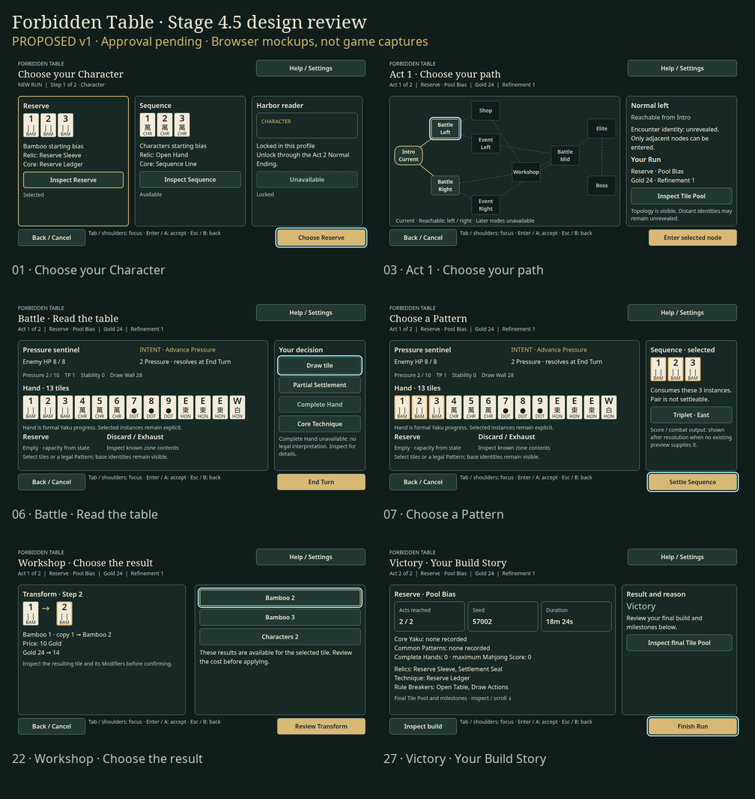

# Stage 4.5 UI/UX — design review v1

**2026-10-01 · Proposed · Awaiting maintainer review.** Issue [#98](https://github.com/sunnyday9/Forbidden-Table/issues/98) remains open. This package is design and mockups only. No Godot UI, gameplay, Domain, persistence, content budget, or Stage 5 naming changes are authorized by this package.

[Editable Figma review](https://www.figma.com/design/xXzt7gEelGQh37Ak51ogGa) · [Local mockup gallery](gallery.html) · [Screen audit and journey](AUDIT_AND_FLOW.md) · [Visual system](VISUAL_SYSTEM.md) · [Interaction and verification plan](INTERACTION_AND_VALIDATION.md) · [Screen/state manifest](screen_manifest.json) · [Design checks](VALIDATION.md) · [Figma sync status](FIGMA_STATUS.md)

The 36 browser mockups and enlarged-text/window specimens are in `mockups/`. Six full-size native Figma exports and three native review indexes are in `mockups/figma/`. The self-contained gallery links each drawing to its matching editable Figma frame. All 36 frames have been refined directly in the supplied Education copy; see [sync evidence](FIGMA_STATUS.md).

## Proposed direction

A supernatural Mahjong table rendered through dark green felt, ink panels, ivory tiles, and restrained brass edges. Space and type establish the hierarchy. Brass marks the selected choice; a pale cyan perimeter marks navigational focus, independently. Tile suit, rank, honor identity, and rule-changing marks remain readable without color. No atmospheric artwork is required to understand or operate a screen.

The central change is composition: replace the generic overview/actions columns with a persistent status strip, purpose-specific decision surfaces, an actual tile tray, and a contextual inspector. Keep intent and critical Battle resources visible while secondary build information scrolls separately. Use ordinary localized text whenever an icon or visual effect would obscure meaning.

## Review scope

Review the complete journey and state captures in the gallery, especially Battle/Settlement, map knowledge visibility, Workshop target/result/commit, and the focus-versus-selection specimens. Values in new mockups are illustrative layout fixtures, not replay captures, balance proposals, or new content. Existing names and Contract tradeoffs come from current source. New explanatory copy is proposed wording for existing mechanics and must be reconciled with localization at implementation time.

The only current supported/tested game viewport in Stage 4 evidence is 960×540 at the default scale. Enlarged-window/text specimens in this package are design targets, not claims of implemented support. The game has no current UI-scale selector. Normal/Fast/Instant exist in the presentation API; the proposed settings surface exposes them without changing rule resolution.

## Branch provenance

- Base: Stage 4 PASS `0f565b937b0157a02fd0922bdf8bc4c2ee4e4d31`, branch `codex/stage4-beta-content`.
- Working branch: `codex/stage4-5-uiux-design`, isolated checkout created for this task.
- Spec: cherry-pick of `9003451050122164850d7b36af1d95423b524e62`, resulting commit `f5b276a`. Exactly the Stage 4.5 spec and its Project Spec insertion; no stale-parent implementation was imported.
- Stage 4 source/captures remain unchanged. Existing untracked `graphify-out/`, `scripts/__pycache__/`, and unrelated checkout work are outside this package.

## Approval gate

**Design approval is pending.** Requested decision: approve this visual direction and the versioned mockups, or identify screen/state changes for v2. Approval must name the accepted version and any exceptions before game UI implementation starts. Do not infer approval from file creation, automated layout checks, or screenshots. Record maintainer feedback on #98 when authorized; no issue write or closure is part of this session.

After approval, implement only the approved presentation changes, then run the existing full and affected gates and capture the real Godot build. Stage 4.5 PASS and issue closure require a separate implemented-evidence review. Stage 5 remains **1.0 Release Candidate**.
