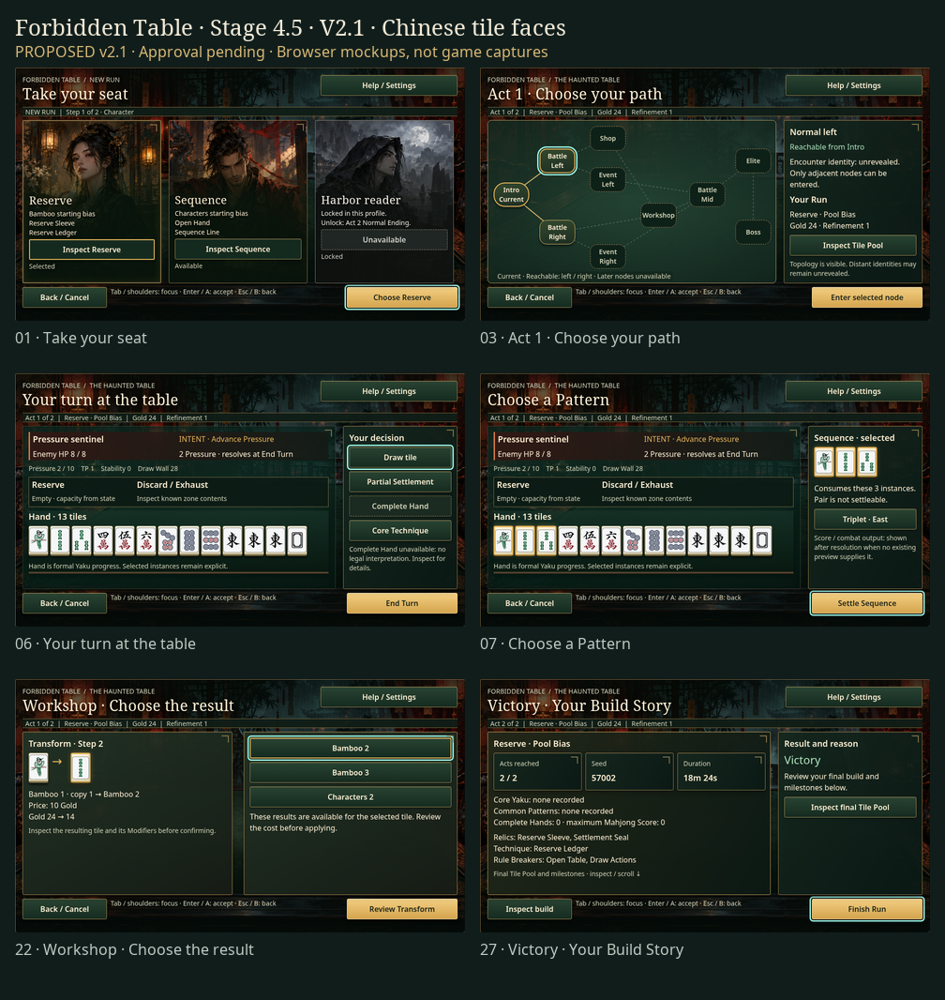

# Forbidden Table · V2.1 design review

**2026-10-01 · Proposed V2.1 · Approval pending.** This revision responds to the feedback that V1 felt too formal and that the tiles should use standard Chinese faces. It proposes an atmospheric supernatural Mahjong game: a rain-lit salon, painted Character portraits, lacquered decision surfaces, carved brass edges, and recognizable Chinese Mahjong tiles.

[Editable Figma V2](https://www.figma.com/design/xXzt7gEelGQh37Ak51ogGa?node-id=2022-2) · [Interactive gallery](gallery.html) · [Art, components, and motion rules](ART_AND_MOTION.md) · [Validation evidence](VALIDATION.md) · [36-screen manifest](screen_manifest.json)

[Chinese tile catalog](tile-atlas.html) · [Tile source, attribution, and license](assets/chinese-tiles/README.md). All 34 existing tile identities have exact asset mappings. The visible faces use Chinese numerals/萬, counted circles and bamboo, 東南西北, 中, 發, and framed 白板. English names remain in inspection and accessible labels.



## Review the demonstration

Open the gallery, choose a screen, then choose a motion study and **Replay animation**. Four studies demonstrate tile arrival, Complete Hand → Boss phase → Victory, reward reveal, and Workshop before/after. Compare Normal, Fast, Instant, and Reduced motion; Stop or Escape restores a readable static composition. Lantern glow can be turned off separately.

The gallery works from local files. For a served preview, run this command from the worktree root and open the URL below:

```bash
python3 -m http.server 8845 --bind 127.0.0.1
```

`http://127.0.0.1:8845/forbidden_table_spec/design/stage4_5/v2/gallery.html`

The Figma page **04 · V2 — Haunted Table & Motion** contains all 36 editable screen frames, two artwork masters, 34 Chinese tile-face masters and their catalog, scoped V2 variables, a native motion study, and three review indexes. V1 remains available for comparison. Native Figma exports are in [mockups/figma](mockups/figma/README.md); browser captures are in `mockups/`. These are separate renderers, with small differences in material effects and text rasterization.

## Coverage and inherited constraints

The [screen audit and flow map](../AUDIT_AND_FLOW.md), [input/state contract](../INTERACTION_AND_VALIDATION.md), and [V1 mechanical fixtures](../source/screens.json) continue to define the journey. V2 changes their presentation. Character and Contract selection, both Act maps, Battle, Pattern/Settlement, Events, all reward types, Shop, Workshop, tutorial, help, settings, recovery, and every Run Summary/end state have V2 drawings. Focused, selected, disabled, empty, confirmation, error, and contextual detail specimens remain included.

Readability > state clarity > tile recognition > animation feedback > decoration. Brass selection and cyan focus remain independent. Ordinary text carries prices, costs, intent, legality, reasons, and ordered results. Artwork is cosmetic and may be removed without losing an action path.

960×540 is the current Stage 4 supported/tested baseline. The gallery's 125%/150% text and larger-window specimens are design targets. Browser inspection is available; Godot/controller navigation, production scaling, and localization gates have not been implemented or re-run here.

## Approval gate

Review the V2.1 tile catalog, Character portraits and Battle composition first, then replay the four motion studies and inspect the full journey. Approval must explicitly identify **V2.1** and any exceptions before game UI implementation starts. Tile assets, portrait appearances, background art, revised headings, and material treatments are proposed cosmetic choices.

Issue [#98](https://github.com/sunnyday9/Forbidden-Table/issues/98) remains open. No UI game code, gameplay system, Domain state, content budget, or release-stage change is included. Stage 5 remains **1.0 Release Candidate**. This package has not been approved and does not constitute Stage 4.5 PASS.
