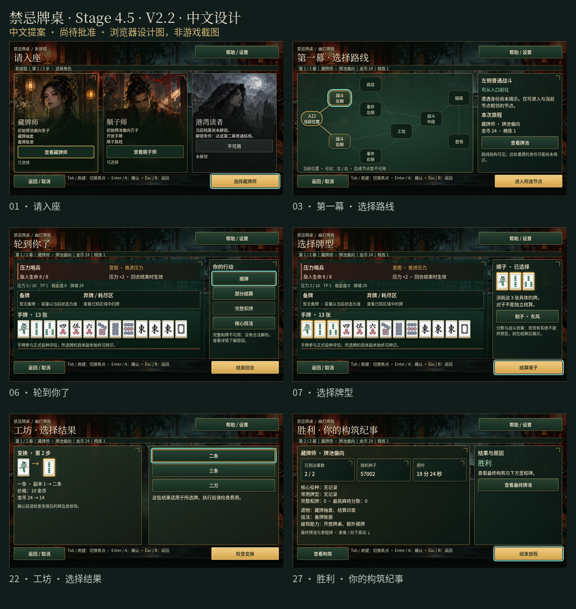

# 禁忌牌桌 · 中英双语设计 V2.2

**2026-10-01 · 设计提案，尚待批准。** MVP 的语言目标为 **English + 简体中文（zh_CN）**。本次增加中文设计与双语交互规范，不代表游戏已实现中文，也不代表已批准美术或发布。

[中文交互画廊](../gallery-zh_CN.html) · [英文画廊](../gallery.html) · [语言设置样例](../language.html) · [可编辑中文 Figma](https://www.figma.com/design/xXzt7gEelGQh37Ak51ogGa?node-id=2044-2) · [中文语言设置 Figma](https://www.figma.com/design/xXzt7gEelGQh37Ak51ogGa?node-id=2045-579) · [双语 MVP 实现与验收要求](BILINGUAL_MVP.md)

中文版本保留雨夜牌厅、幽灯、绘制角色立绘、玉色与漆木面板、黄铜操作按钮和标准中国麻将牌面。正文使用 Noto Sans SC，标题使用 Noto Serif SC；保留英文版的字号层级、布局、牌张身份、选择描边与独立焦点描边。中文字体随设计包提供，可离线查看，来源及许可见 [字体说明](fonts/README.md)。

## 完整旅程与覆盖

新旅程 → 角色 → 契约 → 第一幕地图 → 战斗 / 事件 / 商店 / 工坊 → 首领 → 破规能力奖励 → 第二幕地图 → 战斗与路线节点 → 第二幕首领 → 旅程总结 → 结束。

战斗内：摸牌 → 查看具体牌实例 → 选择合法牌型 → 检查解析与费用 → 部分结算或完整和牌 → 按序反馈。工坊内：服务 → 具体目标牌 → 合法结果 → 费用确认 → 修改结果。所有阶段均保留返回与取消路径。

36 个中文画面与英文版逐一对应，包括两个幕地图、三类奖励、教程、帮助、设置、胜利、失败、旧记录、暂停存档、恢复失败与放弃确认。另有两个中英语言设置样例。已选择、有焦点、不可用、空状态、确认、错误和详情状态都有示例；完整清单见 [中文画面数据](source/screens.zh_CN.json)。

可在画廊顶部切换 English / 简体中文。切换保留当前画面、反馈速度、减少动态效果、灯笼光晕与布局样例；这是评审工具行为。游戏中的语言偏好保存、输入路径与焦点恢复尚待实施和验证。

## 排版与组件规范

- 优先级：可读性 > 状态清晰 > 牌面识别 > 动画反馈 > 装饰。
- 正文 16 / 24，次要说明 14 / 20，标题 32 / 40；中文正文不增加字距，不使用装饰字体承载费用、规则、错误或操作。
- 中文和英文采用独立文案，同一组件保持相同语义。角色「藏牌师」与区域「备牌」区分，角色「顺子师」与牌型「顺子」区分；术语见 [双语术语表](TERMINOLOGY.md)。
- 保留完整费用、风险、回报、不可用原因和具体副本编号。数值与身份来自同一状态；切换语言不改变规则或显示虚构预估值。
- 黄铜边表示所选项，3px 青色边表示焦点；两者可同时出现。禁止仅靠颜色表达关键状态。
- 牌面统一使用原始 34 张中国麻将图像。界面文字为简体中文时，牌面仍保留常见的萬、東、發等标准字形；不增加花牌、赤牌或其他玩法。
- 按钮允许换行；长说明在详情区独立滚动，关键操作栏保持可见。避免中文标点落在行首。错误代码、存档路径、随机种子及插值占位符保持原样。

## 动效与操作

中文反馈顺序与英文相同：**完整和牌已结算 → 首领进入第二阶段 → 胜利**。标准 / 快速 / 瞬时及减少动态效果均保留结果文字；瞬时模式不等待动画。四个动效样例可重播，Esc 或停止按钮结束演示。灯笼光晕可独立关闭。

鼠标可点击；Tab / 肩键移动焦点，方向键 / 十字键导航，Enter / A 确认，Esc / B 返回或取消。具体牌实例选择无需拖拽。浏览器已检查键盘焦点；Godot 与手柄完整路径必须在批准后的实现阶段验证。

## 证据与批准边界

[验证记录](VALIDATION.md) 区分浏览器设计图、Figma 图与尚待实施的游戏功能。截图包括全部 36 个中文画面、125% / 150% 文本样例和三个较大窗口样例；这些较大窗口与字体尺度仍是设计目标，不能据此声称游戏支持或原生设备性能。

当前游戏仅注册英文。现有 **962** 个英文运行时键已列在 [运行时键清单](source/runtime-key-inventory.csv)，完整中文翻译、占位符检查、字体导入和语言偏好保存尚待批准后的实现。本次 [双语设计文案 CSV](source/design-copy.en_zh_CN.csv) 为设计交付，不能当作完整的运行时翻译表。

请审核 V2.2 的中文用语、双语设置与整体美术后，明确批准实现。Issue #98 保持开放；Stage 5 仍为 **1.0 Release Candidate**。不改变游戏规则、权威 Domain 状态、内容预算或发布授权。
